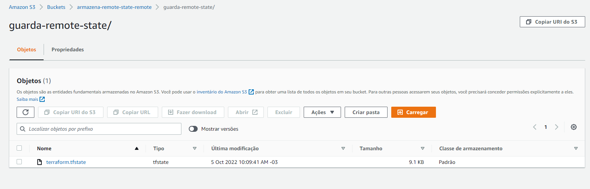

## Anotações
#### Antes de inicializar esse projeto precisar criar o bicket s3 aonde vai ficar o tsstate dele. O Projeto buckets3

#### Inicializa o projeto
```
terraform init -backend-config="access_key=Sua Chave aqui" -backend-config="secret_key=Sua Chave Aqui"
```
#### Então dore o apply
```
terraform apply -var="chave=aqui sua chave" -var="segredo=aqui seu segredo"
```
#### O Resultado final experado na aws
 </br>
##### Este é um projeto vazio que tem como fundamentação salvar remoto o tfstate, como deve ser feito por padrão em aplicações comerciais normalmente.
